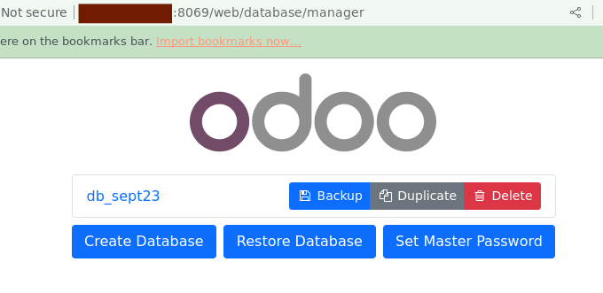

Database manager
================

url : http://IP_server:8069/web/database/manager

On y accede aussi par le lien sur la page du login.

On obtient:

   
* backup / Duplicate / Delete me demande le master password. 
* Create : me demande:
   * master password : je peux les definir moi meme?
   * et un email il faut mettre quel email.
   * password lequel je choisi je peux le definir moi meme
   * phone number ? 
   * Language
   * country 
   * data demo ? 

Je crée une database db_mars24 avec tjs les mêmes mots de passe et email adminodoo@ophtalmologie.org. La connection dure un temps fou sur Brave. Finalement j'ai une page blanche